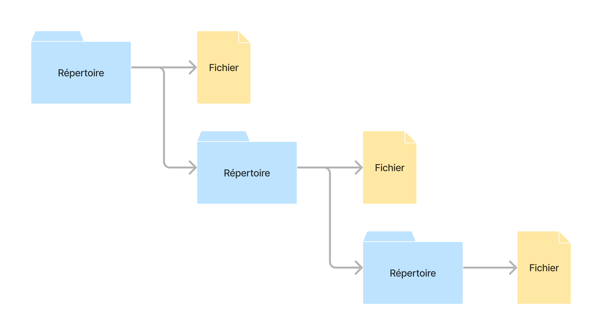
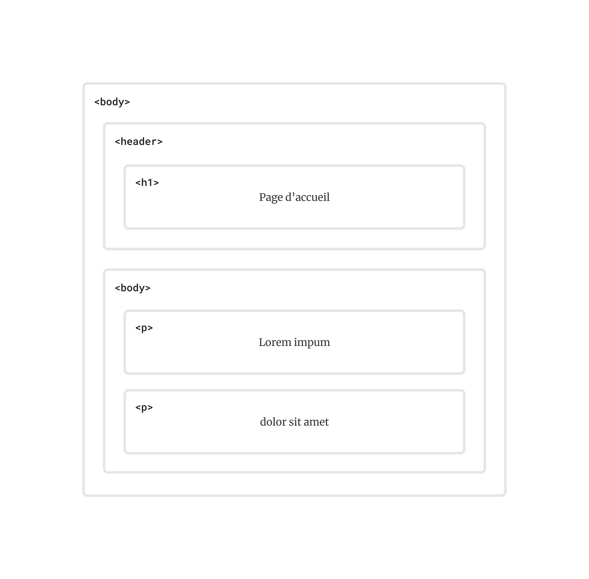

# Les listes

Vous avez sûrement déjà arrangé des informations sous forme de liste.
Avant d'aller faire les courses, on écrit une liste des articles à
acheter. Au début d'un projet, on rédige une liste de tâches. À
l'approche de notre anniversaire, on fait une liste de souhaits. Pour
organiser une fête, on fait une liste des invité·es. Puisque plusieurs
informations prennent la forme de listes, il nous faut une façon de les
représenter au sein de nos programmes.

## Créer une liste

Lorsqu'on écrit une liste, on commence toujours avec une liste vide,
puis on y ajoute un élément à la fois. Considérons par exemple une liste
des planètes. On commence par une liste vide des planètes, puis on y
ajoute Mercure, puis Vénus, puis la Terre, et ainsi de suite. 


Il en va de même pour notre langage de programmation. En Racket, une
liste vide est représentée par la constante `'()`, appelée « *empty* »
(vide, en français). `'()` est une valeur primitive, comme le sont
`#true` et `5`. 

Comme toutes les autres valeurs de notre langage d'apprentissage, les
listes sont *immuables*, c'est-à-dire qu'on ne peut pas les modifier.
Pour ajouter un élément à une liste, il faut donc créer une nouvelle
liste. La fonction `cons` permet de *cons*truire une liste à partir
d'une autre liste. 

Par exemple, l'expression ci-dessous construit une nouvelle liste à
partir de la chaîne `"Mercure"` et de la liste vide `'()`.

```racket
(cons "Mercure" '())
```

La fonction `cons` prend deux arguments : la valeur qu'on désire
ajouter, et la liste à laquelle ajouter cette valeur. Notez qu'on
utilise le verbe « ajouter », mais que `cons` ne modifie pas la liste
originale (tout comme `(+ 1 2)` modifie ni `1`, ni `2`). Plutôt, `cons`
construit une nouvelle liste qui inclut la valeur donnée.

Pour ajouter une seconde planète à notre liste des planètes, il suffit
d'appeler `cons` de nouveau. Cette fois, le deuxième argument ne sera
pas une liste vide, mais plutôt la liste contenant `"Mercure"`.

```racket
(cons "Vénus" (cons "Mercure" '()))
```

On répètera la même opération pour ajouter une troisième planète.

```racket
(cons "terre" (cons "vénus" (cons "mercure" '())))
```

L'expression ci-dessus construit une liste qui contient trois chaînes :
`"Terre"`, `"Vénus"`, et `"Mercure"`. Bien sûr, une liste peut contenir
d'autres types de valeurs.

Voici une liste qui contient les nombres `1`, `2`, et `3` :

```racket
(cons 1 (cons 2 (cons 3 '())))
```

Il est également possible de mélanger des valeurs de différents types.
Ainsi, une liste peut contenir des informations à propos d'un objet en
particulier. La liste ci-dessous, par exemple, à laquelle nous avons
assigné le nom `mars`, contient le nom de la planète, sa circonférence,
et si elle est habitée ou non.

```racket
(define mars (cons "Mars" (cons 6772 (cons #false '()))))
```

## Les paires

Vous remarquerez qu'une liste est composée de *paires*. Notre liste des
planètes contient trois paires. La première paire contient `"Mercure"`
ainsi que la liste vide `'()`. La deuxième paire contient `"Vénus"`
ainsi que la première paire. La troisième paire contient `"Terre"` ainsi
que la deuxième paire. Chaque paire comprend deux éléments : 

1.  une valeur (une chaîne, un nombre ou un booléen); et
2.  une liste (vide ou non).


Le diagramme ci-dessus illustre bien qu'une liste est construite avec
des paires. On y voit comment une paire pointe vers une valeur et vers
une autre paire, laquelle pointe vers une valeur et une autre paire, et
ainsi de suite jusqu'à ce qu'une paire pointe finalement vers une liste
vide.

Notre langage d'apprentissage ne fait pas de distinction entre une paire
et une liste. Une liste est soit une liste vide, soit une paire dont le
second élément est une liste. Prenez une respiration, et relisons la
phrase précédente :

Une liste est soit une liste vide, soit une paire dont le second élément
est une liste.

Cette définition est sûrement une des définitions les plus bizarres que
vous avez lues. Après tout, comment peut-on définir quelque chose en se
référant à la chose même que nous essayons de définir ? En réalité, ce
genre de définition est fréquent en informatique. 

Par exemple, un répertoire contient soit des fichiers, soit des
répertoires.



Pareillement, un élément HTML contient soit du texte, soit des éléments
HTML. 



On qualifie ces définitions de *récursives* car elles se réfèrent à la
chose en train d'être définie.

## Accéder aux éléments d'une liste

Notre langage de programmation fournit plusieurs fonctions pour accéder
aux éléments d'une liste. Vous trouverez ci-dessous quelques unes de ces
fonctions natives.

### Premier élément

Pour accéder au premier élément d'une liste, on utilise la fonction
native `first`. La fonction `first` prend comme argument la liste de
laquelle on désire extraire la première valeur, et retourne la valeur en
question.

```racket
(first (cons "Mercure" '())) ; => "Mercure"
(first (cons "Vénus" (cons "Mercure" '()))) ; => "Vénus"
(first (cons "Terre" (cons "Vénus" (cons "Mercure" '())))) ; => "Terre"
```

### Reste

Pour accéder au reste de la liste (c'est-à-dire au deuxième élément de
la paire), on utilise la fonction `rest`. Puisqu'une liste qui n'est pas
vide est une paire dont le deuxième élément est une liste, la fonction
`rest` retourne toujours une liste. Si le reste de la liste est vide,
alors `rest` retourne la constante `'()`.

```racket
(rest (cons "Terre" (cons "Vénus" (cons "Mercure" '())))) ; => (cons "Vénus" (cons "Mercure" '()))
(rest (cons "Vénus" (cons "Mercure" '()))) ; => (cons "Mercure" '())
(rest (cons "Mercure" '())) ; => '()
```

### Liste vide

Pour savoir si une liste est vide, on utilise le prédicat `empty?`.

```racket
(empty? (cons "Mercure" '())) ; => #false
(empty? (rest (cons "Mercure" '()))) ; => #true
(empty? '()) ; => #true
```

## Définition de données

Nous avons défini une liste comme étant soit une liste vide, soit une
paire dont le deuxième élément est une liste. Vous remarquerez que cette
définition ressemble à une énumération. 

Considérons par exemple la liste des planètes. Une liste de planètes est
soit une liste vide, soit une paire dont le premier élément est une
chaîne et le deuxième élément est une liste de planètes.

```racket
;; Une ListeDePlanètes est soit :
;; - '()
;; - (cons Chaîne ListeDePlanètes)
;; interprétation : liste des planètes du système solaire
```

Quoique cette définition peut sembler incongrue, elle nous permet
d'identifier les valeurs qui font partie de la classe `ListeDePlanètes`,
et d'en créer de nouvelles. 

Prenons la liste ci-dessous : 

```racket
(cons "Vénus" (cons "Mercure" '()))
```

Pour déterminer si cette liste est une `ListeDePlanètes`, il faut se
poser deux questions, chacune correspondant à une des possibilités de
l'énumération : 

1.  Est-ce une liste vide ? Si la réponse à cette question est « oui »,
    alors c'est une `ListeDePlanètes`. Sinon, il faut se poser la
    prochaine question.
2.  Est-ce une paire dont le premier élément est une chaîne et le
    deuxième une `ListeDePlanètes` ? Si oui, alors c'est une
    `ListeDePlanètes`. Sinon, ce ne l'est pas.

Revenons donc à notre liste qui contient `"Vénus"` et `"Mercure"`.
Clairement, ce n'est pas une liste vide. Est-ce une paire dont le
premier élément est une chaîne et le deuxième une `ListeDePlanètes` ?

```
(cons "Vénus" (cons "Mercure" '()))
      ------- --------------------
         |             |
      Chaîne    ListeDePlanètes?
```

C'est bien une paire dont le premier élément est une chaîne, mais il est
impossible de dire pour l'instant si le deuxième élément est une
`ListeDePlanètes`.

Examinons donc indépendamment le deuxième élément de la paire. Pour
déterminer si c'est une `ListeDePlanète`, il faut se poser les deux
mêmes questions.

```
(cons "Mercure" '())
      --------- ---
          |      |
       Chaîne ListeDePlanète?

```

Encore une fois, cette liste n'est pas vide. Le premier élément de la
paire est bien une chaîne. Quand est-il du deuxième élément ? Est-il une
une `ListeDePlanètes` ? Examinons celui-ci à part, et posons-nous les
deux même questions.

```
'()
```

Est-ce que la liste ci-dessus est vide ? Oui ! C'est donc une
`ListeDePlanètes`. Et puisque cette liste est bel et bien une
`ListeDePlanètes`, les deux listes précédentes le sont aussi.

## Programmer avec les listes

Pourrions-nous écrire une fonction qui détermine si une liste donnée est
une `ListeDePlanètes` ? Techniquement, nous possédons tous les outils
nécessaires pour traduire les opérations ci-dessus en code. Pour ce
faire, nous suivrons les étapes de conceptions. 

### Signature, but et entête

Une définition de données pour `ListeDePlanètes` a déjà été transcrite
ci-dessus. Passons donc tout de suite à la signature, au but et à
l'entête de notre fonction.

```racket
;; Liste -> Booléen
;; Détermine si la liste donnée est une ListeDePlanètes.
(define (liste-de-planètes? liste) ...)
```

La fonction `liste-de-planètes?` est un prédicat qui détermine si la
`liste` donnée comme argument correspond à la définition de
`ListeDePlanètes`.

## Tests

Avant de se pencher sur corps de la fonction, écrivons les tests. Nous
testerons la fonction avec la même `ListeDePlanètes` utilisée plus haut,
puis avec une liste de nombre.

```racket
(define planètes (cons "Vénus" (cons "Mercure" '())))
(define nombres (cons 1 (cons 2 '())))

(check-expect (liste-de-planètes? planètes) #true)
(check-expect (liste-de-planètes? nombres) #false)
```

### Collecte des données et gabarit

Nous avons vu précédemment que le corps d'une fonction qui manipule une
énumération est toujours une expression conditionnelle. Ici ne fait pas
exception. Puisque la définition d'une liste est une énumération avec
deux possibilités (soit une liste vide, soit une paire dont le second
élément est une liste), le corps de notre fonction sera un `cond` avec
deux clauses.

```racket
(define (liste-de-planètes? liste)
  (cond (... liste ...)
        (... liste ...)))
```

#### Première clause

Les deux clauses correspondent aux deux questions posées précédemment.
D'abord, est-ce que la liste donnée est une liste vide ? Pour déterminer
si une liste est vide, on utilise le prédicat `empty?`. Si la liste est
vide, alors c'est une `ListeDePlanètes`. Nous retournerons donc `#true`.

```racket
(define (liste-de-planètes? liste)
  (cond ((empty? liste) #true)
        (... liste ...)))
```

#### Deuxième clause

Si la liste n'est pas vide, alors il faut déterminer si le premier
élément de la paire est une chaîne *et* si le deuxième élément est une
`ListeDePlanètes`. Si et seulement si ces deux suppositions sont vraies
est-ce que la liste donnée est une `ListeDePlanètes`. 

Heureusement, nous savons déjà comment utiliser le comparateur `and`
pour vérifier si plusieurs suppositions sont vraies. Si la valeur des
des arguments de `and` est `#true`, alors le résultat de `and` (et donc
de la fonction `liste-de-planètes?`) sera également `#true`. Sinon, le
résultat sera `#false`.

```racket
(define (liste-de-planètes? liste)
  (cond ((empty? liste) #true)
        (else (and (... liste ...)
                   (... liste ...)))))
```

Pour accéder au premier élément d'une paire, on utilise la fonction
`first`. Le prédicat `string?` peut ensuite être appliqué sur la valeur
de retour de `first` pour déterminer si c'est une chaîne de caractères
ou non.

```racket
(define (liste-de-planètes? liste)
  (cond ((empty? liste) #true)
        (else (and (string? (first liste))
                   (... liste ...)))))
```

Si le premier élément de la paire est une chaîne, alors il reste à
vérifier si le deuxième élément est une `ListeDePlanètes`. On utilise
donc la fonction native `rest` pour extraire le deuxième élément de la
paire.

```racket
(define (liste-de-planètes? liste)
  (cond ((empty? liste) #true)
        (else (and (string? (first liste))
                   (... (rest liste))))))
```

Maintenant que nous avons accès au deuxième élément de la paire, comment
vérifier si celui-ci est une `ListeDePlanètes` ? Pour ce faire, nous
utiliserons la fonction `liste-de-planètes?` que nous sommes en train de
définir.

```racket
(define (liste-de-planètes? liste)
  (cond ((empty? liste) #true)
        (else (and (string? (first liste))
                   (liste-de-planètes? (rest liste))))))
```

Voilà ! Notre fonction devrait maintenant passer les tests que nous
avons définis plus haut.

Au premier abord, il peut sembler illogique d'appeler une fonction que
nous sommes en train de définir. Rappelez-vous toutefois que nous avons
fait la même chose dans la section précédente pour déterminer par
nous-mêmes si la liste donnée était ou non une `ListeDePlanètes`.

Si vous utilisez le débogueur de DrRacket pour examiner étape par étape
l'exécution de la fonction ci-dessus, vous verrez que l'évaluateur
Racket procède de la même manière que nous. C'est-à-dire que les deux
questions (« Est-ce une liste vide ? » et « Est-ce une paire dont le
premier élément est une chaîne et le second une `ListeDePlanètes` ? »)
sont posées pour chaque paire jusqu'à atteindre une liste vide.
